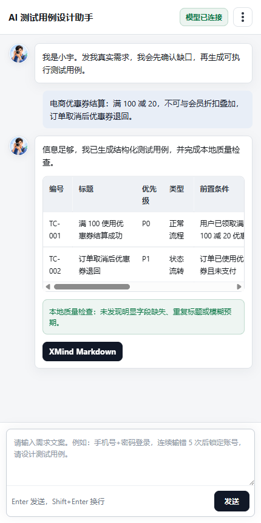

# AI 测试用例设计助手 Chrome 插件

一个本地优先的 Chrome 侧边栏插件，帮助测试、产品和研发把真实需求转成可执行测试用例，并导出为适合 XMind 导入的 Markdown。

<p align="center">
  
</p>

<p align="center">
  <strong>真实优先 · 先澄清再生成 · 面向测试评审和脑图沉淀</strong>
</p>

## 产品截图

<p align="center">
  
</p>

## 为什么做它

很多 AI 生成测试用例工具的问题不是“写得少”，而是：

- 需求不清楚时直接编造规则。
- 用例步骤不可执行。
- 预期结果写成“验证正常”。
- 缺少行业风险意识。
- 输出不适合评审和沉淀。

这个插件的核心目标是让 AI 更像一名谨慎的测试专家：信息不足时先问清楚，信息足够时再生成结构化、可执行、可判断的测试用例。

## 核心优势

- **本地优先**：不依赖项目后端，API Key 和历史记录保存在浏览器本地。
- **用户自有模型**：支持 OpenAI 兼容 `/chat/completions` 接口，可配置 Base URL 和模型名。
- **真实约束**：提示词要求“不能假设、不能编造、缺信息必须追问”。
- **交互式澄清**：信息不足时展示多选项、每题补充和自由补充输入。
- **行业测试知识**：内置电商、IM、短视频、视频会议、AI 等领域的测试关注点。
- **专项测试视角**：覆盖接口、性能、安全、兼容性、可用性、数据一致性和隐私合规。
- **需求追溯**：每条用例标明需求点、依据、风险和测试设计方法，区分真实需求与测试设计推导。
- **双层审查**：生成后先做零成本本地结构审查，并支持按需发起独立 AI 语义复审。
- **人工采纳闭环**：单条用例可采纳、编辑、标记问题或删除，评审状态保存在本地历史中。
- **XMind 友好导出**：可导出全部或仅导出已采纳用例，层级 Markdown 包含追溯信息。

## 当前能力

### 对话生成

- 侧边栏对话式输入需求。
- 当前会话保留上下文。
- 信息不足时先追问，不硬生成。
- 信息足够时生成结构化测试用例。

### 交互澄清

当需求缺少真实业务规则时，小宇会返回可操作的问题面板：

- 每个问题支持多选。
- 每个问题支持单独补充。
- 底部支持自由补充。
- 提交后把用户选择作为已确认事实继续生成。

### 测试知识覆盖

内置提示词会按场景考虑：

- 电商：商品、库存、价格、优惠券、支付、退款、物流、风控、金额一致性。
- IM：单聊、群聊、消息顺序、撤回、离线消息、多端同步、弱网重连。
- 短视频/直播：上传、转码、播放、推荐、互动、审核、内容安全。
- 视频会议：入会、音视频、静音、屏幕共享、主持人权限、录制、弱网。
- AI：提示注入、敏感信息泄露、幻觉、有害内容、成本消耗、降级策略。
- 通用专项：接口、性能、安全、兼容性、可用性、数据与审计、隐私合规。

### 用例审查与采纳

生成结果采用两层审查：

- 本地结构审查：检查追溯字段、必填字段、重复标题、重复步骤与预期、步骤长度、预期可判断性和风险描述。
- 独立 AI 复审：按需检查需求矛盾、覆盖遗漏、边界与状态、重复、可执行性和优先级，给出评分与具体问题。

每条用例支持：

- 采纳或取消采纳。
- 直接编辑字段。
- 标记不准确、重复或不可执行并记录原因。
- 删除无价值用例。

当前实现是“生成角色 + 独立复审角色”的轻量双角色流程。它复用同一个模型服务，不引入并行 Agent 编排，调用成本和排障复杂度可控。

### 导出

当前只保留一个面向脑图沉淀的出口：

- `XMind Markdown`

导出结构示例：

```markdown
# 需求摘要
## 正常流程
### TC-001 用例标题
- 需求点：...
- 依据：原始需求 / 用户补充 / 测试设计推导
- 优先级：P0
- 测试方法：...
- 风险：...
- 前置条件：...
- 测试步骤：...
- 预期结果：...
```

## 安装使用

### 方式一：加载已解压插件

1. 下载或复制 `chrome-extension` 目录。
2. 打开 Chrome，进入 `chrome://extensions`。
3. 开启右上角「开发者模式」。
4. 点击「加载已解压的扩展程序」。
5. 选择当前 `chrome-extension` 目录。
6. 点击插件图标打开侧边栏。

### 方式二：本地调试启动

在插件目录执行：

```powershell
powershell -ExecutionPolicy Bypass -File .\start-chrome-dev.ps1
```

脚本会优先使用 Chrome for Testing。如果没有检测到 Chrome for Testing，会回退到普通 Chrome，并打开扩展管理页供手动加载。

## 模型配置

在侧边栏右上角菜单进入「项目设置」，填写：

- `API Key`
- `Base URL`
- `模型名称`
- 是否启用严格 JSON Schema 输出

推荐先点击「测试连接」。如果模型服务不支持严格 JSON Schema，可关闭该选项。

## 数据与隐私

- API Key 保存在 `chrome.storage.local`。
- 会话历史和生成用例保存在 `chrome.storage.local`。
- 插件只把用户输入的需求和会话上下文发送到用户配置的模型服务。
- 当前版本没有项目后端，插件作者不会接收用户数据。

## 项目结构

```text
chrome-extension/
  manifest.json              # Chrome 插件配置
  sidepanel.html             # 侧边栏页面
  sidepanel.js               # 对话、模型调用、澄清、导出逻辑
  sidepanel.css              # 侧边栏样式
  prompts.js                 # 小宇角色、真实约束、行业测试知识
  options.html/js/css        # 浏览器扩展设置页备用入口
  icons/                     # 插件图标
  assets/                    # 会话头像等视觉资产
  docs/                      # 验收、示例和质量提升文档
```

## 文档

- [验收清单](docs/验收清单.md)
- [示例需求与输出](docs/示例需求与输出.md)
- [生成质量提升计划](docs/生成质量提升计划.md)

## 当前边界

当前版本暂不包含：

- 后端服务。
- 当前页面 DOM 读取。
- Jira / 禅道 / TAPD 回写。
- 插件内文件上传解析。
- 知识库 / RAG。
- 截图 OCR。
- 原生 `.xmind` 文件生成。

这些能力后续可以扩展，但当前 MVP 优先把“真实需求澄清 + 高质量测试用例生成 + XMind Markdown 沉淀”做好。

## 当前状态

这是一个可本地安装试用的 MVP，已经具备侧边栏交互、模型配置、澄清问答、可追溯用例生成、本地结构审查、独立 AI 复审、人工采纳反馈和 XMind Markdown 导出能力。
